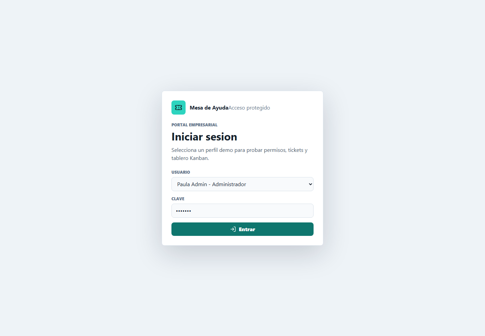
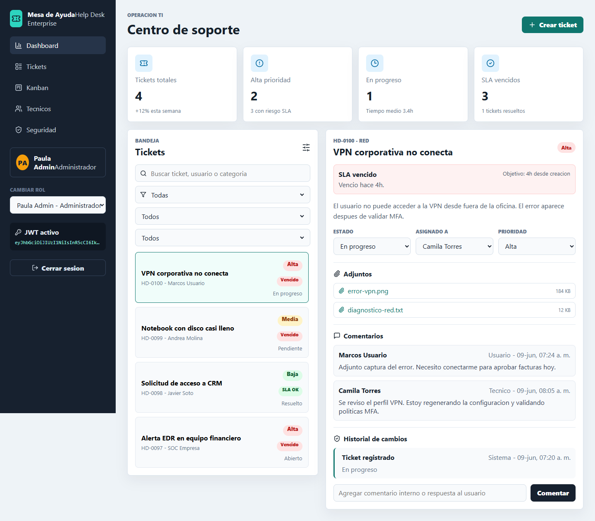
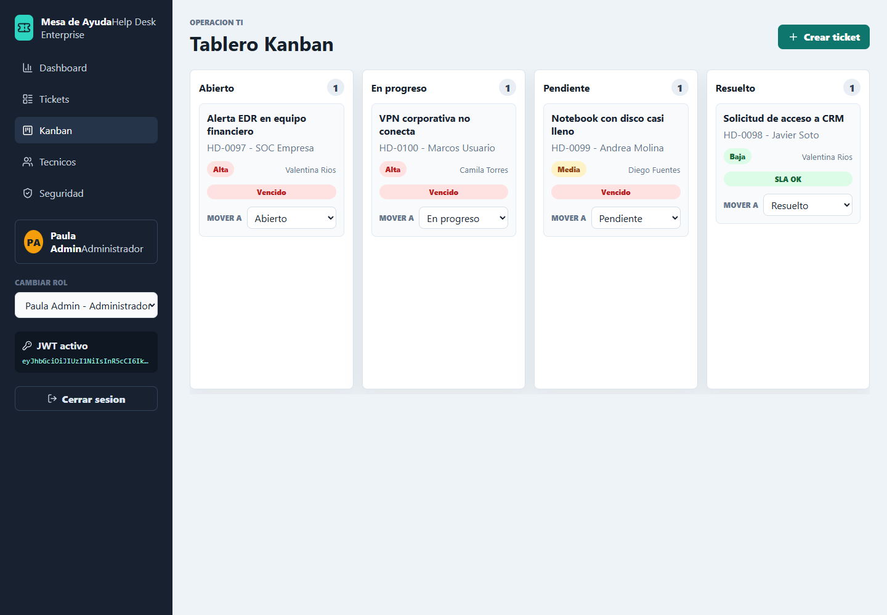

# Mesa de Ayuda (Help Desk)

[](https://react.dev/)
[](https://vite.dev/)
[](https://mesa-de-ayuda.netlify.app/)
[](LICENSE)

Sistema web de mesa de ayuda creado con React y Vite. Permite gestionar tickets de soporte con una interfaz ordenada tipo empresarial.

## Demo online

Puedes ver la aplicacion publicada en Netlify:

[https://mesa-de-ayuda.netlify.app/](https://mesa-de-ayuda.netlify.app/)

## Capturas

### Login



### Dashboard y detalle de ticket



### Tablero Kanban



## Autora

SolangeLisset

## Funcionalidades principales

### Gestion de tickets

La aplicacion permite crear tickets, asignar prioridad, cambiar estado, seleccionar tecnico responsable, agregar comentarios y visualizar adjuntos simulados.


### Dashboard operativo

El panel principal muestra metricas de tickets, prioridad alta, casos en progreso y SLA vencidos para entregar una vista rapida del estado del soporte.

### Kanban con drag and drop

El tablero Kanban organiza los tickets por estado y permite moverlos entre columnas mediante drag and drop o desde el selector de estado.


### Seguridad y roles demo

Incluye pantalla de login, JWT simulado, cambio de rol y permisos diferenciados para Administrador, Tecnico y Usuario.

### SLA e historial de auditoria

Cada ticket muestra SLA visual por prioridad y un historial de cambios para auditar modificaciones de estado, prioridad y tecnico asignado.

## Resumen de funciones

- Dashboard con metricas de tickets.
- Pantalla de login protegida.
- Persistencia en localStorage para conservar tickets al recargar.
- Creacion de tickets.
- Prioridad: Alta, Media y Baja.
- Estado: Abierto, En progreso, Pendiente y Resuelto.
- Asignacion a tecnico.
- Comentarios por ticket.
- Adjuntos simulados.
- Filtros por busqueda, prioridad, estado y tecnico.
- Vista Kanban para revisar y mover tickets por estado.
- Drag and drop en Kanban para cambiar estados.
- SLA visual por prioridad.
- Historial de cambios para estado, prioridad y tecnico.
- Reportes con graficos por estado, prioridad y tecnico.
- Tiempo promedio de resolucion.
- Tickets vencidos por tecnico.
- Exportacion de reportes a CSV y vista imprimible PDF.
- Filtros por rango de fecha.
- Roles simulados: Administrador, Tecnico y Usuario.
- JWT simulado para representar sesion activa.

## Acceso demo

La aplicacion usa usuarios demo para simular roles y permisos.

```text
Clave: demo123
```

Usuarios disponibles:

- Paula Admin - Administrador
- Diego Tecnico - Tecnico
- Marcos Usuario - Usuario

## Tecnologias

- React
- Vite
- Lucide React
- ESLint
- Prettier
- Node test runner
- CSS modular separado del HTML

## Instalacion

```bash
npm install
```

## Ejecutar en desarrollo

```bash
npm run dev
```

Luego abre la URL que muestra Vite, normalmente:

```text
http://127.0.0.1:5173
```

## Crear build de produccion

```bash
npm run build
```

## Calidad y tests

```bash
npm test
npm run lint
npm run format:check
```

Para aplicar formato automaticamente:

```bash
npm run format
```

## Variables de entorno

El proyecto incluye `.env.example` como referencia:

```text
VITE_APP_NAME="Mesa de Ayuda"
VITE_DEMO_URL="https://mesa-de-ayuda.netlify.app/"
VITE_SUPPORT_EMAIL="soporte@empresa.cl"
```

## Documentacion tecnica

La documentacion de arquitectura, flujo de datos, SLA, auditoria y tests esta en:

[docs/technical.md](docs/technical.md)

## Deploy en Netlify

El proyecto incluye `netlify.toml` para que Netlify construya y publique la carpeta correcta.

Configuracion recomendada en Netlify:

```text
Build command: npm run build
Publish directory: dist
```

Pasos:

1. Conecta el repositorio de GitHub en Netlify.
2. Verifica que el comando de build sea `npm run build`.
3. Verifica que el directorio publicado sea `dist`.
4. Haz deploy desde la rama `main`.

Si Netlify publica la raiz del proyecto en vez de `dist`, puede aparecer un error MIME al cargar `/src/main.jsx`. El archivo `netlify.toml` evita ese problema.

## Estructura

```text
helpdesk-react/
  index.html
  netlify.toml
  package.json
  src/
    components/
    hooks/
    main.jsx
    mockData.js
    pages/
    styles.css
    utils/
      auth.js
      tickets.js
```

## Nota

El JWT y los roles estan simulados en frontend para fines demostrativos. Para produccion se recomienda conectar la app a un backend con autenticacion real, base de datos, almacenamiento de adjuntos y control de permisos en servidor.
